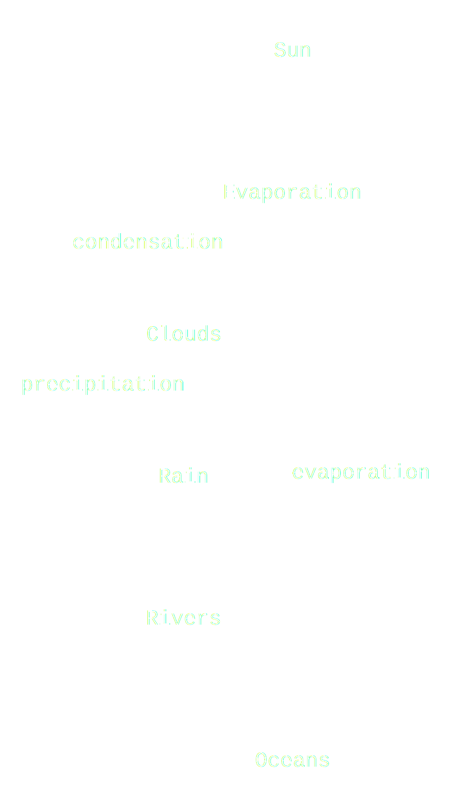

# Drawn

**Drawn** is a lightweight CLI tool for **diagrams-as-code** – helping architects and engineers design, version, and share system diagrams using simple text syntax.

## Example

From this simple code:
```bash
Sun --> Evaporation
Evaporation -(condensation)-> Clouds
Clouds -(precipitation)-> Rain
Rain --> Rivers
Rivers --> Oceans
Oceans -(evaporation)-> Evaporation
```
To this diagram:



## Features

- **Simple arrow syntax** - `A --> B --> C`
- **Multi-line support** - Handle complex flows
- **Branching flows** - One node to multiple destinations  
- **Professional output** - High-quality SVG/PNG via Graphviz
- **Fast rendering** - Instant feedback
- **Test coverage** - Reliable and maintainable

## Philosophy

- **Simple over complex** - Minimal syntax that anyone can learn
- **Fast feedback** - From idea to diagram in 30 seconds
- **Git-friendly** - Text-based diagrams that version well
- **Local-first** - No internet required, no complex setup

## Quick Start

### Installation
```bash
# Clone the repo
git clone git@github.com:parthivrmenon/drawn.git
cd drawn

# Install dependencies
pip install graphviz

# Create your first diagram
echo "API --> Server --> DB" > flow.drawn
python main.py flow.drawn
```

## Testing

```bash
# Run all tests
python -m pytest tests/

# Run tests with verbose output
python -m pytest tests/ -v
