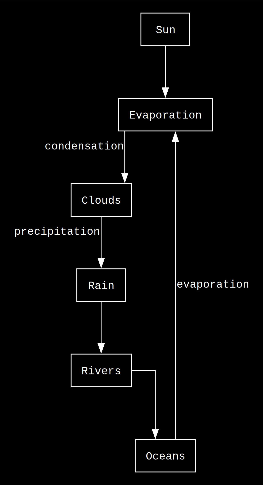

# Drawn

**Drawn** is a lightweight CLI tool for **diagrams-as-code** – helping architects and engineers design, version, and share system diagrams using simple text syntax.

## Example

From this simple code:
```
Sun --> Evaporation
Evaporation -(condensation)-> Clouds
Clouds -(precipitation)-> Rain
Rain --> Rivers
Rivers --> Oceans
Oceans -(evaporation)-> Evaporation

```
To this diagram:



## Features

- **Simple arrow syntax** - `A --> B --> C`
- **Multi-line support** - Handle complex flows
- **Branching flows** - One node to multiple destinations  
- **Professional output** - High-quality SVG/PNG via Graphviz
- **Fast rendering** - Instant feedback
- **Test coverage** - Reliable and maintainable
- **Inline configuration** - Simple directives using % prefix

## Philosophy

- **Simple over complex** - Minimal syntax that anyone can learn
- **Fast feedback** - From idea to diagram in 30 seconds
- **Git-friendly** - Text-based diagrams that version well
- **Local-first** - No internet required, no complex setup
- **Self-contained** - All diagram information in a single file

## Quick Start

### Installation
```bash
# Clone the repo
git clone git@github.com:parthivrmenon/drawn.git
cd drawn

# Install dependencies
pip install graphviz

# Create your first diagram
echo "API --> Server --> DB" > flow.drawn
python main.py flow.drawn
```

### Usage

```bash
# Basic usage
python main.py flow.drawn
```

## Configuration

You can configure your diagrams using simple directives with a `%` prefix:

### Basic Configuration

```
% output_file: filename      # Output filename (default: flow)
% output_format: svg|png|pdf # Output format (default: svg)
% comment: My Diagram        # Title for the diagram (default: Flow)
```

### Graph Attributes

```
% graph_bgcolor: transparent  # Background color (default: transparent)
% graph_dpi: 300             # Resolution in DPI (default: 300)
% graph_rankdir: TB          # Direction: TB (top-bottom), LR (left-right) (default: TB)
% graph_splines: ortho       # Line style: ortho, curved, etc. (default: ortho)
% graph_pad: 0.2             # Padding around the graph (default: 0.2)
% graph_nodesep: 1           # Horizontal separation between nodes (default: 1)
% graph_ranksep: 0.8         # Vertical separation between nodes (default: 0.8)
```

### Node Attributes

```
% node_fontname: Courier     # Font for node labels (default: Courier)
% node_fontsize: 12          # Font size for node labels (default: 12)
% node_fontcolor: white      # Font color for node labels (default: white)
% node_shape: box            # Node shape: box, circle, ellipse, etc. (default: box)
% node_style: filled         # Node style: filled, dashed, etc. (default: filled)
% node_fillcolor: transparent # Fill color for nodes (default: transparent)
% node_color: white          # Border color for nodes (default: white)
% node_margin: 0.15,0.1      # Margin inside nodes (default: 0.15,0.1)
```

### Edge Attributes

```
% edge_fontname: Courier     # Font for edge labels (default: Courier)
% edge_fontsize: 12          # Font size for edge labels (default: 12)
% edge_fontcolor: white      # Font color for edge labels (default: white)
% edge_color: white          # Edge line color (default: white)
% edge_arrowhead: normal     # Arrow style: normal, vee, dot, etc. (default: normal)
% edge_penwidth: 0.8         # Edge line thickness (default: 0.8)
```

### Themes

Drawn supports three built-in themes that control the visual styling of your diagrams:

```
% theme: light    # Black on white (default)
% theme: dark     # White on black  
% theme: matrix   # Bright green terminal aesthetic
```

#### Examples
<div align="center">
<table>
  <tr>
    <td align="center"><b>Light Theme</b><br/>Clean, professional diagrams</td>
    <td align="center"><b>Dark Theme</b><br/>High contrast on dark background</td>
    <td align="center"><b>Matrix Theme</b><br/>Terminal-style hacker aesthetic</td>
  </tr>
  <tr>
    <td></td>
    <td></td>
    <td></td>
  </tr>
</table>
</div>

**Available Themes:**
- `light` - Black text on white background (default)
- `dark` - White text on black background
- `matrix` - Bright green text on black background with terminal styling

## Testing

```bash
# Run all tests
python -m pytest tests/

# Run tests with verbose output
python -m pytest tests/ -v
