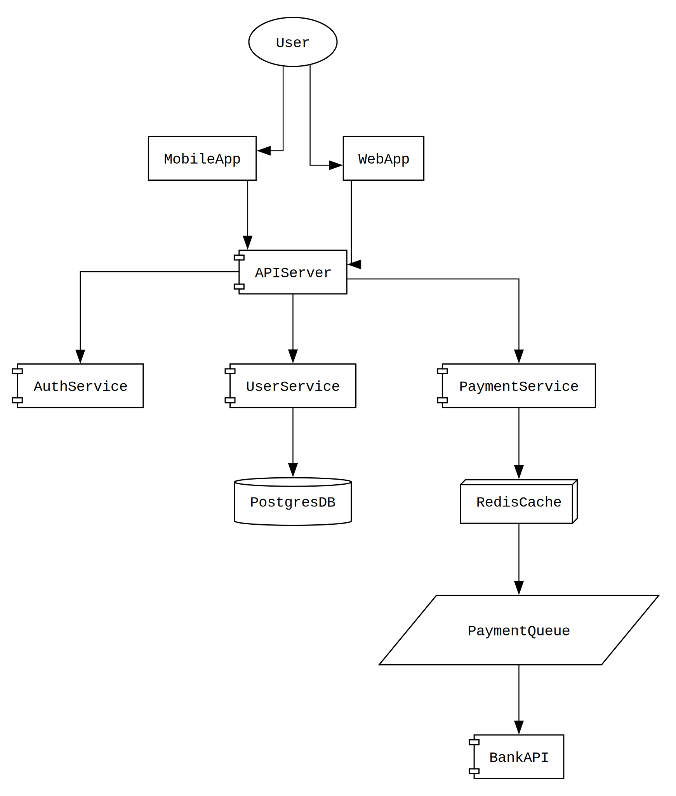
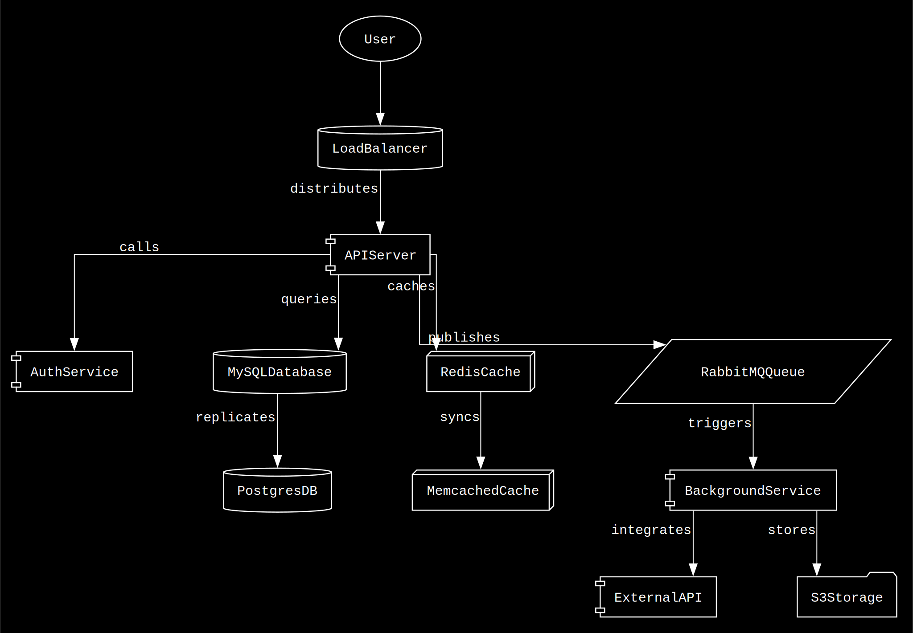

# Drawn ✨

**Drawn** is a really **minimalistic** and **lightweight** CLI tool for **diagrams-as-code** – It helps you generatebeautiful system diagrams from simple text notation! 🚀

## Example

From this simple code:
```
Sun --> Evaporation
Evaporation -(condensation)-> Clouds
Clouds -(precipitation)-> Rain
Rain --> Rivers
Rivers --> Oceans
Oceans -(evaporation)-> Evaporation

```
To this diagram:


## What's Inside? 📖
- [Features](#features)
- [Philosophy](#philosophy)
- [Quick Start](#quick-start)
- [Configuration](#configuration)
- [Testing](#testing)
- [Advanced Configuration](#advanced-configuration)

## Features 🎯

- **Simple arrow syntax** - `A --> B --> C`
- **Multi-line support** - Handle complex flows
- **Branching flows** - One node to multiple destinations  
- **Professional output** - High-quality SVG/PNG via Graphviz
- **Fast rendering** - Instant feedback
- **Test coverage** - Reliable and maintainable
- **Inline configuration** - Simple directives using % prefix

## Philosophy 🧘‍♂️

- **Simple over complex** - Minimal syntax that anyone can learn
- **Fast feedback** - From idea to diagram in 30 seconds
- **Git-friendly** - Text-based diagrams that version well
- **Opinionated** - Simple and consistent styling
- **Advanced configuration** - Customise every aspect of the diagram if required.


## Quick Start 🏃‍♂️

### Installation

#### Prerequisites
Drawn requires [Graphviz](https://graphviz.org/download/) to be installed on your system:

```bash
# macOS
brew install graphviz

# Ubuntu/Debian
sudo apt-get install graphviz

# Windows
# Download and install from: https://graphviz.org/download/
```

#### Install from PyPI (Recommended) 🎉
```bash
# Install the latest stable version
pip install drawn-cli

# Create your first diagram
echo "API --> Server --> DB" > flow.drawn
drawn flow.drawn
```

#### Install from Source 🛠️
```bash
# Clone the repo
git clone git@github.com:parthivrmenon/drawn.git
cd drawn

# Install the package
pip install .
```

#### Development Installation 👩‍💻
```bash
# Clone the repo for development
git clone git@github.com:parthivrmenon/drawn.git
cd drawn

# Install dependencies (optional, for full package install)
pip install -e .

# Or run directly without installation
python drawn/cli.py flow.drawn
```

### Usage 🎮

```bash
# Basic usage
echo "API --> Server --> DB" > flow.drawn
drawn flow.drawn
```

## Configuration 🎛️

You can configure your diagrams using simple directives with a `%` prefix:

### Basic Configuration 🎯

```
% output_file: filename      # Output filename (default: flow)
% output_format: svg|png|pdf # Output format (default: svg)
% comment: My Diagram        # Title for the diagram (default: Flow)
```

For advanced configuration options, see [Advanced Configuration](#advanced-configuration).

### Themes 🎨

Drawn supports three built-in themes that control the visual styling of your diagrams:

```
% theme: light    # Black on white (default)
% theme: dark     # White on black  
% theme: matrix   # Bright green terminal aesthetic
```

#### Examples
<summary>Clean and simple on white background</summary>
<br/>

<br/>

<summary>High contrast on dark background</summary>
<br/>

<br/>

<summary>Terminal-style hacker aesthetic</summary>
<br/>

<br/>

**Available Themes:**
- `light` - Black text on white background (default)
- `dark` - White text on black background
- `matrix` - Bright green text on black background with terminal styling

## Testing 🧪

{{ ... }}
# Run all tests
python -m pytest tests/

# Run tests with verbose output
python -m pytest tests/ -v

## Advanced Configuration 🎛️

### Graph Attributes 📊

```
% graph_bgcolor: transparent  # Background color (default: transparent)
% graph_dpi: 300             # Resolution in DPI (default: 300)
% graph_rankdir: TB          # Direction: TB (top-bottom), LR (left-right) (default: TB)
% graph_splines: ortho       # Line style: ortho, curved, etc. (default: ortho)
% graph_pad: 0.2             # Padding around the graph (default: 0.2)
% graph_nodesep: 1           # Horizontal separation between nodes (default: 1)
% graph_ranksep: 0.8         # Vertical separation between nodes (default: 0.8)
```

### Node Attributes 🔵

```
% node_fontname: Courier     # Font for node labels (default: Courier)
% node_shape: box            # Node shape: box, circle, ellipse, etc. (default: box)
% node_style: filled         # Node style: filled, dashed, etc. (default: filled)
% node_fillcolor: transparent # Fill color for nodes (default: transparent)
% node_color: black          # Border color for nodes (default: black)
% node_margin: 0.15,0.1      # Margin inside nodes (default: 0.15,0.1)
```

### Edge Attributes 

```
{{ ... }}
% edge_fontsize: 12          # Font size for edge labels (default: 12)
% edge_fontcolor: white      # Font color for edge labels (default: white)
% edge_color: white          # Edge line color (default: white)
% edge_arrowhead: normal     # Arrow style: normal, vee, dot, etc. (default: normal)
% edge_penwidth: 0.8         # Edge line thickness (default: 0.8)
```

### Auto-Shapes 🤖

Drawn automatically selects appropriate node shapes based on node names to improve diagram readability:

```
% auto_shapes: true     # Enable automatic shape selection (default: true)
% auto_shapes: false    # Disable automatic shape selection
```

**Shape Mappings:** 🗺️
- **Databases** (`db`, `database`, `sql`, `postgres`, `mysql`) → `cylinder`
- **Caches** (`cache`, `redis`, `memcached`) → `box3d`
- **Queues** (`queue`, `kafka`, `rabbitmq`) → `parallelogram`
- **Storage** (`storage`, `bucket`, `s3`) → `folder`
- **Components** (`api`, `service`, `server`) → `component`
- **Users** (`user`, `customer`) → `ellipse`
- **Default** (all others) → `box`
